# yelp-sentiment-lakehouse
## Dashboard Preview

An end-to-end cloud-based data engineering project built using Snowflake, AWS S3, Python, SQL, and Power BI to analyze customer sentiment from Yelp business reviews. The pipeline processes large-scale semi-structured JSON data, performs sentiment analysis using TextBlob, builds a Medallion Architecture (Bronze, Silver, Gold), and generates analytical business insights through SQL views and dashboards.

## Architecture

```mermaid
graph LR
    %% Data Source & Local Processing (Outside the Cloud)
    Source[Yelp JSON Data]:::source --> |Local Path| PyScript[Python Chunking Script]:::script
    
    %% The "Hand-off" to Cloud
    PyScript --> |Upload to| S3[Amazon S3]:::storage

    %% Cloud Storage Subgraph
    subgraph DataLake ["Cloud Storage (AWS)"]
        S3
    end

    %% Warehouse Subgraph
    subgraph SnowflakeDW ["Snowflake Data Warehouse"]
        S3 --> Bronze[(Snowflake Bronze)]:::db
        Bronze --> Silver[(Snowflake Silver)]:::db
        Silver --> Gold[(Snowflake Gold)]:::db
    end

    %% Consumption Layer
    Gold --> |DirectQuery| PBI[Power BI Dashboard]:::viz

    %% --- STYLING ---
    classDef source fill:#f9f,stroke:#333,stroke-width:2px;
    classDef script fill:#ff9,stroke:#333,stroke-width:2px;
    classDef storage fill:#f96,stroke:#333,stroke-width:2px,color:white;
    classDef db fill:#69c,stroke:#333,stroke-width:2px,color:white;
    classDef viz fill:#d4af37,stroke:#333,stroke-width:2px,color:black;

```

### Bronze Layer:
- Raw JSON ingestion from AWS S3
- Snowflake VARIANT data storage
### Silver Layer:
- Data cleaning and transformation
- JSON flattening
- Sentiment analysis using TextBlob
- Data quality handling
### Gold Layer:
- Fact and dimension modeling
- Business analytics aggregations
### Analytics Layer:
- Top businesses by sentiment
- Category performance
- City-level customer satisfaction
- Monthly sentiment trends
- Sentiment distribution analysis
---
## Tech Stack 
- Python
- Snowflake
- SQL
- AWS S3
- TextBlob
- Power BI
---
## Key Features 
- End-to-end ETL pipeline
- Cloud-based data warehouse architecture
- Sentiment analysis on customer reviews
- Semi-structured JSON processing
- Medallion Architecture implementation
- Analytical SQL views for business intelligence

---

